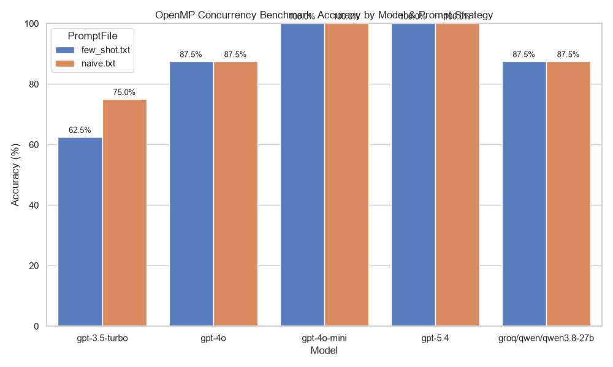
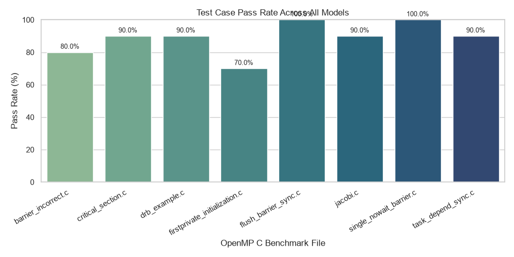

# OpenMP LLM Concurrency Verification Benchmark

This repository evaluates the capability of modern Large Language Models (LLMs) to verify the functional correctness and concurrency safety of OpenMP C code.

## Benchmark Overview
- **Dataset**: 8 OpenMP C benchmark programs covering standard synchronization and scoping patterns, including `critical`, `barrier`, `flush`, `firstprivate`, `single nowait`, `task depend`, and stencil-style shared-state updates.
- **Prompt Strategies**:
  - `naive.txt`: Direct code verification without prior domain examples.
  - `few_shot.txt`: In-context examples demonstrating step-by-step reasoning on parallel race conditions.
- **Evaluated Models**: `gpt-3.5-turbo`, `gpt-4o-mini`, `gpt-4o`, `gpt-5.4`, and `groq/qwen/qwen3.8-27b`.

---

## Dataset Breakdown & Verification Objectives (8 Benchmark Programs)

This benchmark evaluates OpenMP code verification across 8 distinct patterns currently represented in the recorded CSV runs:

| Benchmark File | OpenMP Feature / Pattern | Concurrency Pattern & Objective | Ground Truth |
| :--- | :--- | :--- | :---: |
| `critical_section.c` | Mutual Exclusion (`#pragma omp critical`) | Verifies thread-safe updates to shared variables under mutual exclusion locks. | **CORRECT** |
| `barrier_incorrect.c` | Barrier Synchronization | Tests whether models detect a broken barrier-based ordering pattern that allows unsafe shared-state access. | **INCORRECT** |
| `drb_example.c` | Unsynchronized Shared Access | Tests detection of data races caused by unsynchronized array writes in parallel loops. | **INCORRECT** |
| `flush_barrier_sync.c` | Memory Visibility (`#pragma omp flush`) | Tests recognition of explicit memory flushes and variable cache synchronization across threads. | **INCORRECT** |
| `firstprivate_initialization.c` | Variable Scoping (`firstprivate`) | Verifies whether models distinguish thread-private copies from updates to the outer scope. | **INCORRECT** |
| `single_nowait_barrier.c` | Task Synchronization (`single nowait`) | Evaluates detection of race conditions caused by omitting implicit barriers in single-threaded regions. | **INCORRECT** |
| `task_depend_sync.c` | Task Graphs (`depend(in/out)`) | Tests verification of explicit task-dependency DAGs and forced execution ordering. | **CORRECT** |
| `jacobi.c` | Stencil / Shared-State Update Pattern | Evaluates whether models catch unsafe iterative updates and incorrect shared-memory reuse in a stencil-style computation. | **INCORRECT** |

---
## Results & Visualizations

### 1. Overall Model Accuracy by Prompting Strategy



#### Significance & Key Observations:
* **Top Performance**: `gpt-4o-mini` and `gpt-5.4` both achieved a perfect overall accuracy of **100.0%** (16/16), while `gpt-4o` and `groq/qwen/qwen3.8-27b` both reached **87.5%** (14/16).
* **Prompting Sensitivity**: `gpt-3.5-turbo` showed the largest drop with `few_shot.txt`, falling from **75.0%** (6/8) under `naive.txt` to **62.5%** (5/8). The strongest models were robust across both prompt styles.
* **Few-Shot Stability**: `gpt-4o-mini` and `gpt-5.4` remained at **100%** under both prompt strategies, indicating that the benchmark is not fundamentally dominated by prompting style for the best-performing models.

---

### 2. Test Case Pass Rate Across All Models



#### Significance & Key Observations:
* **Best Overall Accuracy**: `gpt-4o-mini` and `gpt-5.4` led the benchmark with **100.0%** overall accuracy (16/16).
* **Mid-Tier Stability**: `gpt-4o` and `groq/qwen/qwen3.8-27b` each achieved **87.5%** overall accuracy (14/16), with identical performance under both prompt strategies.
* **Most Error-Prone Cases**: `firstprivate_initialization.c` and `barrier_incorrect.c` were the hardest cases in the recorded runs, with pass rates of **70.0%** and **80.0%** respectively across all model attempts.
* **Strongest Case**: `flush_barrier_sync.c` and `single_nowait_barrier.c` were correctly classified by all models in the CSV, each reaching **100.0%** pass rate.

---

## Key Takeaways

1. **`gpt-4o-mini` and `gpt-5.4` are the clear leaders**
   - Both models achieved **100.0%** accuracy across the 16 recorded runs.
   - They also remained perfectly stable under both `naive.txt` and `few_shot.txt` prompting.

2. **Prompt style matters most for weaker models**
   - `gpt-3.5-turbo` performed best with `naive.txt` prompting (**75.0%**) and regressed under `few_shot.txt` (**62.5%**).
   - The stronger models did not show this degradation.

3. **Scope and barrier reasoning remain the dominant failure modes**
   - `firstprivate_initialization.c` and `barrier_incorrect.c` were the lowest-performing benchmark cases in the aggregate results.
   - This suggests that variable scoping and barrier-order reasoning remain the key challenge for LLM-based verification.

---

## Accuracy Summary Table (8 Benchmark Cases / 16 Total Runs per Model)

| Model | Naive Pass Rate | Few-Shot Pass Rate | Overall Accuracy |
| :--- | :---: | :---: | :---: |
| **gpt-4o-mini** | **100.0%** (8/8) | **100.0%** (8/8) | **100.0%** (16/16) |
| **gpt-5.4** | **100.0%** (8/8) | **100.0%** (8/8) | **100.0%** (16/16) |
| **gpt-4o** | 87.5% (7/8) | 87.5% (7/8) | **87.5%** (14/16) |
| **groq/qwen/qwen3.8-27b** | 87.5% (7/8) | 87.5% (7/8) | **87.5%** (14/16) |
| **gpt-3.5-turbo** | 75.0% (6/8) | 62.5% (5/8) | **68.8%** (11/16) |

---

## Repository Structure

```bash
.
├── openmp/             # C code benchmark implementations & specification JSON
├── prompts/            # Prompt templates (naive.txt, few_shot.txt)
├── results/            # Saved raw text outputs per model execution
├── results.csv         # Aggregated benchmark evaluation logs
├── run_eval.py         # LiteLLM test runner
└── README.md
```

## Setting up the environment

Once you have cloned the repo, create a virtual environment

Then run: 

```bash
pip install -r requirements.txt
```

## Setting API keys in the terminal

Export any API keys to the terminal as follows:

```bash
export OPENAI_API_KEY="saerfserger......"
```

or

```bash
export GROQ_API_KEY="saerfserger......"
```

and so on.

## Running the Evaluation
To execute the benchmark against any supported model:

```bash
python run_eval.py --model gpt-4o --prompt-file naive.txt --code-file barrier_incorrect.c
```

Or through one of the shell scripts, for example:

```bash
models/openai/gpt_5.4.sh
```
